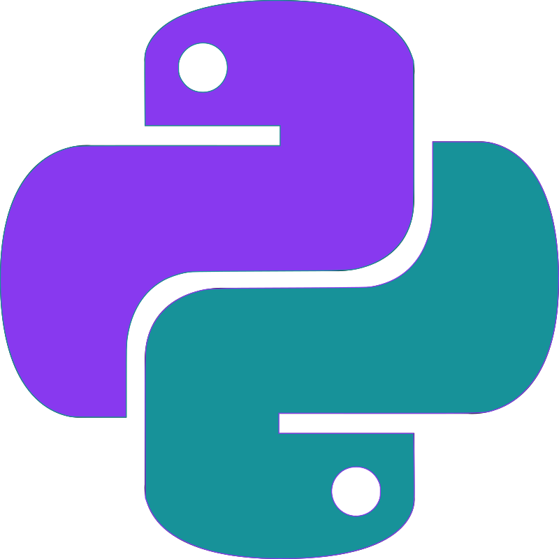
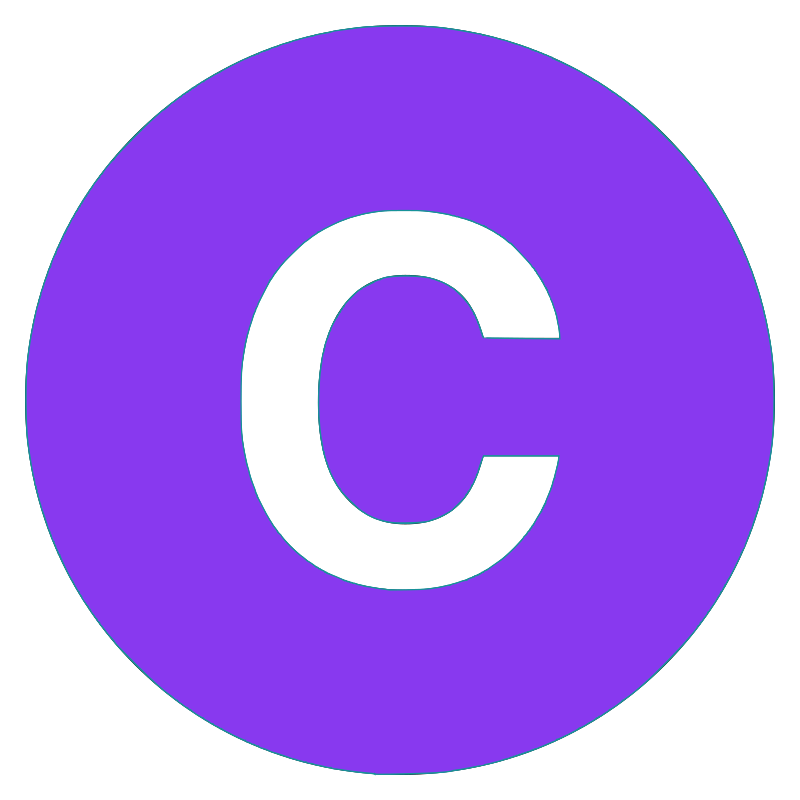

<!--    Project: Profile Page
        Author:  Evgenii Shiliaev
        Date:    24.10.2023        -->

  

  <a href="https://drive.proton.me/urls/AS61GNH84W#Tdrj09dYHllo" style="font-size: 150%">CV</a> •
  <a href="https://www.linkedin.com/in/evgenii-shiliaev/" style="font-size: 150%">LinkedIn</a>

---

<h3 align="center">🔭 Currently Improving</h3>

  
  

---

<h3 align="center">📫 How to Reach Me</h3>

  
  

---

<h3 align="center">📈 GitHub Stats</h3>

  

---

<h3 align="center">💼 Check these repos out!</h3>

  
  

  

<!--- End of README.md --->
